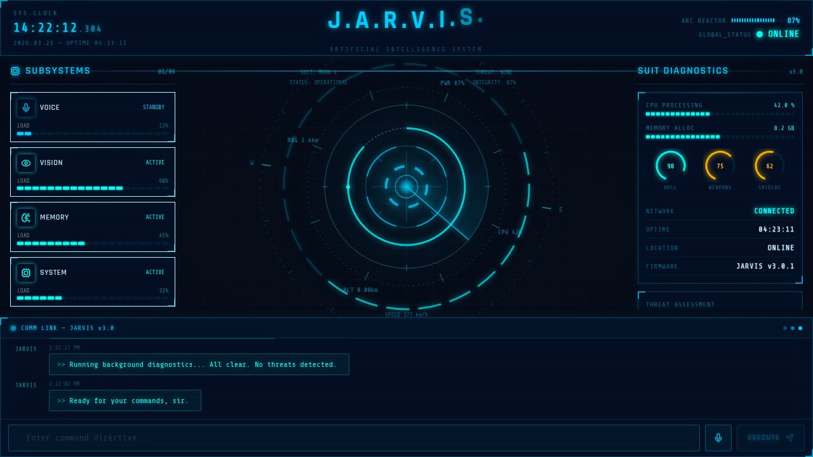

# J.A.R.V.I.S. — AI Assistant Interface

> *"Just A Rather Very Intelligent System"*  
> Inspired by the iconic Iron Man HUD designed by Jayse Hansen & Perception Studio



---

## Overview

A fully authentic **Iron Man movie-style JARVIS AI assistant** web interface built with React + Vite. Replicates the iconic holographic HUD aesthetic with electric cyan radial diagnostic widgets, arc reactor core animation, targeting reticle, radar sweep, fighter-jet panel aesthetics, and animated agent/system panels.

---

## Features

- **Arc Reactor Core** — Animated canvas with concentric rotating rings, dashed orbit ring with N/E/S/W cardinal labels, segmented data arc, radar sweep cone, targeting reticle with gap crosshairs, and an animated power arc fill dot
- **Live System Clock** — Real-time clock with milliseconds, uptime counter, and date display
- **Subsystems Panel** — 6 AI agent cards (Voice, Vision, Memory, System, Internet, Security) with live load bars and status badges
- **Suit Diagnostics** — CPU/memory progress bars, circular arc gauges for Hull/Weapons/Shields, network status, firmware readout, and threat assessment
- **COMM LINK Terminal** — Full command interface with JARVIS response simulation, animated thinking indicator, and message history
- **Export Session Log** — Download your full conversation log as a Stark Industries styled `.txt` file
- **Authentic HUD Design** — Electric cyan (`#00CFFF` / `#00FFF7`) color scheme, CRT scanline overlay, holographic grid background, corner bracket decorations, radial vignette

---

## Tech Stack

| Layer | Technology |
|-------|------------|
| Framework | React 18 + TypeScript |
| Build Tool | Vite |
| Styling | Tailwind CSS v4 |
| Animation | Framer Motion |
| Canvas | HTML5 Canvas API |
| Icons | Lucide React |
| Fonts | Rajdhani (display) + Share Tech Mono |
| Package Manager | pnpm (workspace monorepo) |

---

## Getting Started

### Prerequisites

- [Node.js](https://nodejs.org/) v18 or higher
- [pnpm](https://pnpm.io/) v8 or higher

```bash
npm install -g pnpm
```

### Installation

```bash
# Clone the repository
git clone https://github.com/Davood121/jenman.git
cd jenman

# Install all dependencies
pnpm install
```

### Running the App

```bash
# Start the JARVIS frontend
pnpm --filter @workspace/jarvis run dev
```

Open your browser to the URL shown in the terminal (usually `http://localhost:5173`).

### Running with the API Server

```bash
# Start both the frontend and API server
pnpm --filter @workspace/jarvis run dev &
pnpm --filter @workspace/api-server run dev
```

---

## Project Structure

```
jenman/
├── artifacts/
│   ├── jarvis/                    # Main JARVIS frontend
│   │   ├── src/
│   │   │   ├── components/
│   │   │   │   ├── AiCore.tsx         # Arc reactor canvas widget
│   │   │   │   ├── AgentPanel.tsx     # Left subsystems panel
│   │   │   │   ├── SystemPanel.tsx    # Right diagnostics panel
│   │   │   │   ├── TopBar.tsx         # Header with clock & power
│   │   │   │   └── CommandInterface.tsx # COMM LINK terminal
│   │   │   ├── hooks/
│   │   │   │   └── use-jarvis-system.ts # State & metrics hook
│   │   │   ├── pages/
│   │   │   │   └── Dashboard.tsx      # Main layout
│   │   │   └── index.css              # HUD theme & animations
│   │   └── package.json
│   └── api-server/                # Express API backend
│       ├── src/
│       │   ├── app.ts
│       │   └── routes/
│       └── package.json
├── package.json
├── pnpm-workspace.yaml
└── tsconfig.json
```

---

## Design Reference

This interface is inspired by the work of:

- **[Jayse Hansen](https://jayse.tv)** — Lead UI designer for Iron Man, Avengers HUDs
- **[Perception Studio](https://experienceperception.com)** — "HUD Bible" holographic interface principles

### Color Palette

| Token | Hex | Usage |
|-------|-----|-------|
| `--j-cyan` | `#00CFFF` | Primary HUD color |
| `--j-teal` | `#00FFF7` | JARVIS response accent |
| `--j-red` | `#FF3C3C` | Threat / alert indicators |
| `--j-bg` | `#060C18` | Deep navy background |

---

## Customisation

### Adding New JARVIS Responses

Edit `artifacts/jarvis/src/hooks/use-jarvis-system.ts` and add strings to the `JARVIS_RESPONSES` array.

### Changing Metrics Behaviour

The `useJarvisSystem` hook simulates fluctuating CPU, memory, and power metrics every 2 seconds. Adjust the ranges in the `setMetrics` callback inside the second `useEffect`.

### Adding New Agent Cards

Add a new entry to the `agents` state array in `use-jarvis-system.ts`:

```typescript
{ id: '7', name: 'Weapons Agent', status: 'STANDBY', load: 0 }
```

---

## License

MIT — feel free to use, modify, and distribute.

---

<div align="center">
  <sub>Built with ❤️ on Replit &nbsp;•&nbsp; Inspired by Stark Industries</sub>
</div>
